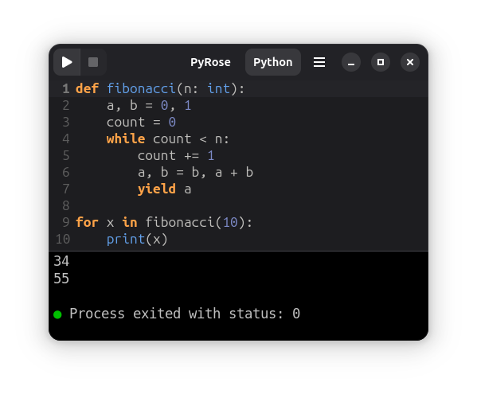

# PyRose

PyRose is a playground for programmers.

## Install

## Install Pyrefly

For a better PyRose experience with Python install [Pyrefly](https://pyrefly.org/).

    uv tool install pyrefly --force